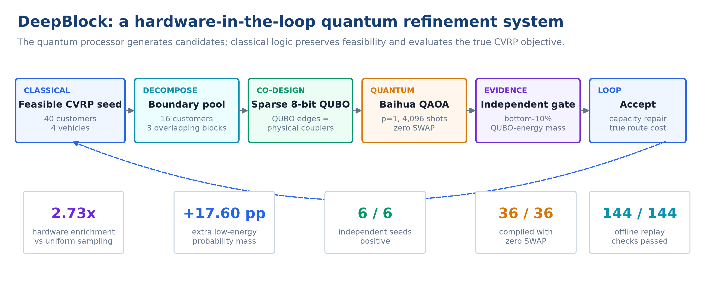
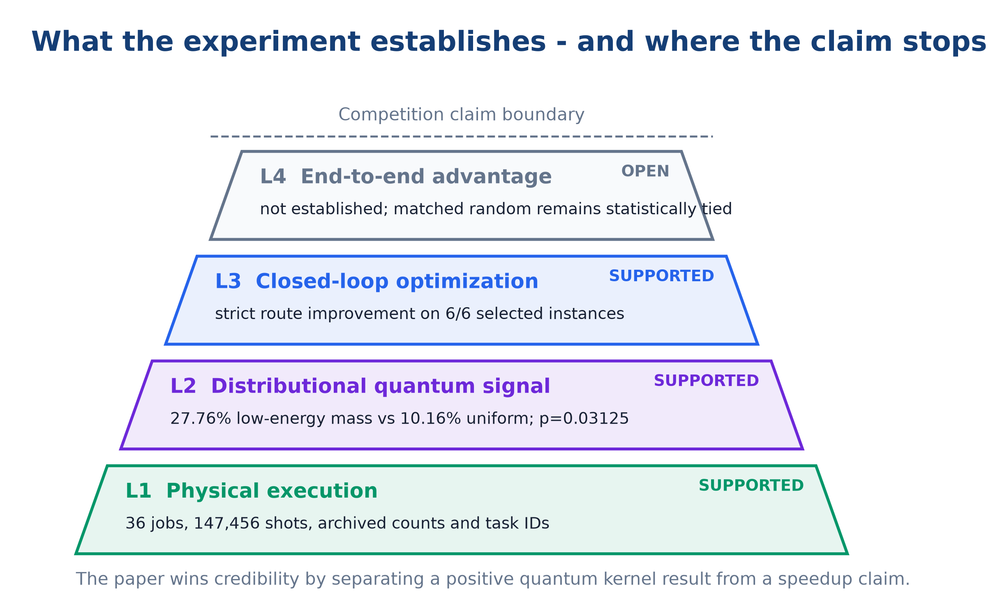
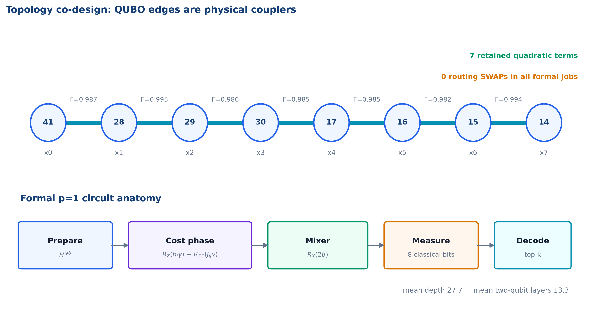
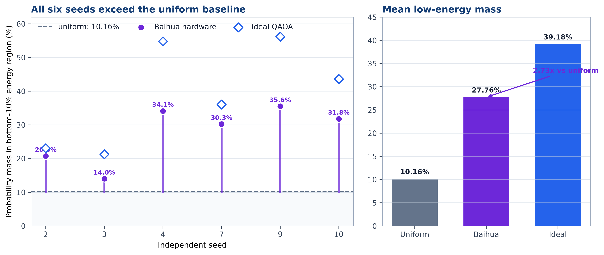
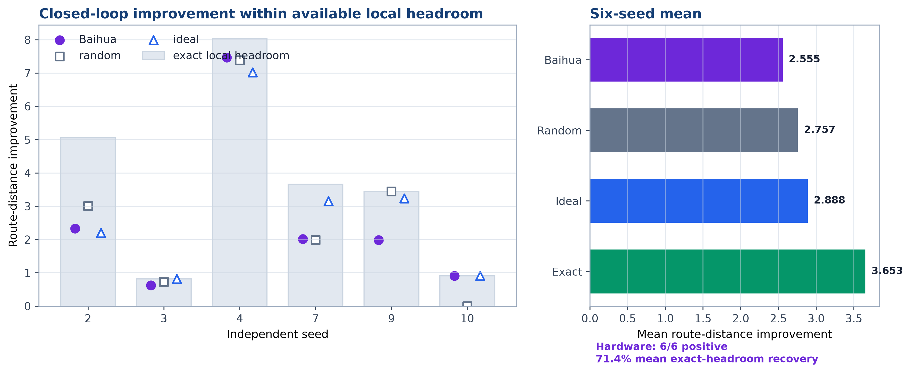
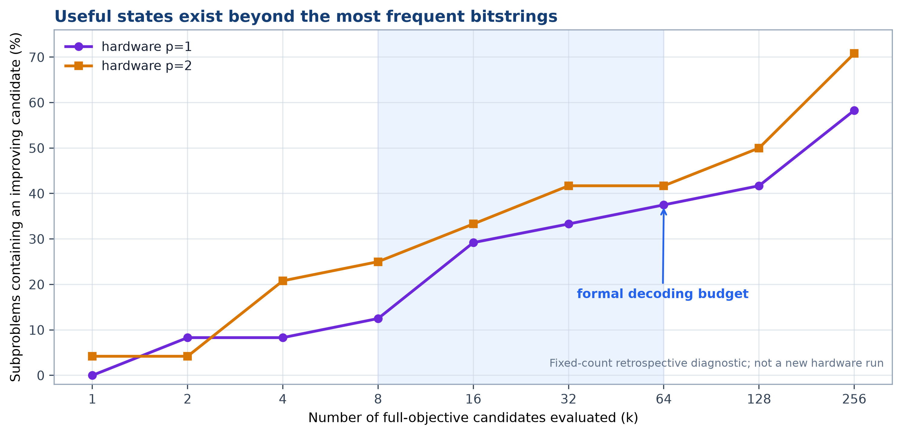
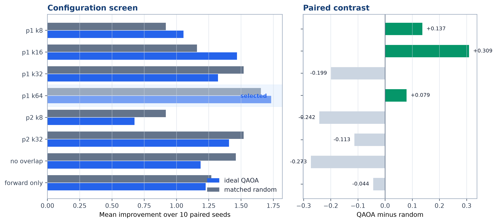
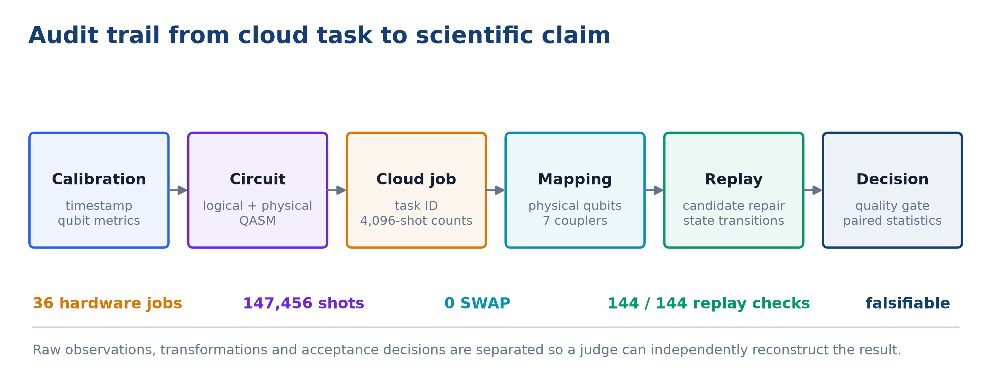

# 摘要

在当前量子硬件上做组合优化，最容易得到的是“线路运行成功”，最难回答的是“量子样本究竟贡献了什么”。本项目以容量约束车辆路径问题（CVRP）为对象，提出DeepBlock拓扑共设计混合精化框架：经典端先构造容量可行路线，从相邻车辆边界提取16位客户，并组成三个最多8变量、相邻重叠3客户的局部块；量子端将局部重分配编码为稀疏QUBO，使每条保留的二次项直接对应Baihua处理器上的物理耦合；测量结果返回后，经典端只负责容量修复、真实路线距离计算与严格改善接受。

论文没有用最终路线结果反推量子贡献，而是给量子核设置独立门槛：对每个8比特QUBO精确枚举256个状态，将能量最低的26个状态预定义为高质量区。Baihua真机在该区域的平均概率质量为27.76%，均匀随机为10.16%，理想QAOA为39.18%。因此，真机相对同一QUBO上的均匀随机实现2.73倍低能富集，增加17.60个百分点；6/6个独立种子方向一致，精确符号翻转检验$p=0.03125$。换句话说，真实硬件保留了理想QAOA“超出随机部分”的60.6%，并非输出近似均匀的bitstring。

正式实验执行36个Baihua任务，每任务4,096 shots，总计147,456 shots；全部任务0 SWAP，平均线路深度27.7，平均双量子位门层数13.3。量子候选进入完整CVRP闭环后，在6/6个有局部余量的40客户、4车辆实例上产生严格改善，平均恢复71.4%的局部精确余量。项目同时保存任务ID、校准快照、逻辑与物理QASM、物理映射、原始counts和状态转移，并完成144/144条离线重放。本文的核心结论不是量子加速，而是一个更适合现阶段硬件、也更容易由评委复核的事实：**Baihua真机在拓扑共设计QUBO上形成了显著的低能采样偏置，这一偏置已经被接入真实约束、真实目标和单调接受组成的优化闭环。**

**关键词：** CVRP；QAOA；QUBO；量子-经典混合优化；超导量子计算；候选质量；拓扑共设计

{width=100%}

# 1. 评委真正需要判断的问题

CVRP同时包含客户分配、访问顺序、车辆容量和子回路约束。直接位置编码通常需要随客户数二次增长的量子位，还会产生稠密罚项；即使成功映射到小型设备，路由SWAP和线路深度也足以淹没低能信号。把完整40客户问题直接交给量子机，在今天并不是有雄心，而是没有把硬件限制写进算法。

DeepBlock选择另一条路线：让量子机进入一个它确实能影响、也能被独立考核的局部搜索位置。我们的判断不是“量子机能否替代OR-Tools”，而是以下三个递进问题：

1. **量子分布是否有信息？** 在同一QUBO上，真机是否比均匀随机更集中于预先规定的低能区域？
2. **信息是否进入优化闭环？** 这些样本经过可行性修复与真实路线评价后，是否真的改变CVRP状态？
3. **系统瓶颈在哪里？** 当前限制来自硬件噪声、代理目标错位，还是经典端只读取了太少的量子候选？

这三个问题分别对应“量子性”“有效性”和“工程性”。只报告一个最优bitstring无法回答它们；只报告最终路线也无法区分量子采样、经典修复和接受规则的作用。因此，本文从一开始就把量子核证据与端到端证据拆开。

{width=84%}

## 1.1 本项目的四项技术贡献

**贡献一：把量子贡献写成可否证的统计命题。** 每个量子子问题的“高质量区”只由QUBO能量排序决定，不读取真机counts，也不依赖路线是否接受。若Baihua没有形成低能偏置，27.76%这一数值会退回10.16%附近，结论自然失败。

**贡献二：从建模阶段消除路由开销。** 我们不是先构造稠密QUBO再让编译器补救，而是先选Baihua高保真物理链，再只保留链上直接耦合对应的二次项。正式任务使用物理量子位$[41,28,29,30,17,16,15,14]$，36/36个真机线路不需要SWAP。

**贡献三：让真机counts逐块改变后续问题。** 三个重叠DeepBlock采用$B_1\rightarrow B_2\rightarrow B_3\rightarrow B_3\rightarrow B_2\rightarrow B_1$双向扫描。前一块接受的客户分配会改变后一块的QUBO，因此36次硬件调用不是一次静态演示，而是hardware-in-the-loop状态演化。

**贡献四：把失败信息变成工程结论。** $p=2$在个别种子恢复更多精确余量，却没有稳定改善；相反，把$p=1$的候选预算从$k=8$扩展到$k=64$，使种子2/3/4的真机平均路线改进从1.593增至3.475。现阶段最先该修的不是线路深度，而是量子代理与真实路线目标的对齐，以及如何使用长尾低频样本。

# 2. 问题、边界与混合分工

## 2.1 CVRP与局部重分配

设仓库为节点0，客户集合为$V=\{1,\ldots,n\}$，车辆集合为$K=\{1,\ldots,m\}$，客户需求为$d_i$，车辆容量为$Q$，节点间距离为$c_{ij}$。完整CVRP的路线目标为

$$
\min \sum_{k\in K}\sum_{i,j\in V\cup\{0\}} c_{ij}y_{ijk},
$$

其中$y_{ijk}=1$表示车辆$k$从节点$i$行驶到节点$j$。完整模型还需满足一次访问、流守恒、容量和子回路消除约束。

DeepBlock固定大部分当前解，只在一对相邻车辆$a,b$之间重新分配局部客户块$B=\{v_1,\ldots,v_w\}$，$w\le 8$。二进制变量$x_i=0$表示客户$v_i$属于车辆$a$，$x_i=1$表示属于车辆$b$。量子端优化的是稀疏代理能量

$$
E_Q(\mathbf{x})=c+\sum_{i=1}^{w}h_i x_i+\sum_{(i,j)\in\mathcal{E}_{\mathrm{phy}}}J_{ij}x_i x_j,
$$

其中$\mathcal{E}_{\mathrm{phy}}$不是任意完全图，而是选定物理链支持的逻辑边集合。线性项综合边界几何和负载变化，二次项表示客户共同移动的相互作用。代理能量用于塑造采样分布，最终接受仍以完整CVRP路线距离为准。

## 2.2 为什么必须保留经典端

量子核输出的是局部二进制重分配，不直接承诺容量可行，也不直接包含完整访问顺序。若把容量修复和路径重建隐藏在“量子算法”内部，任何路线改善都无法归因。因此我们明确划分职责：

| 环节 | 量子端 | 经典端 |
|---|:---:|:---:|
| 低能局部分配候选生成 | 是 | 随机/模拟/精确对照 |
| 容量约束检查与确定性修复 | 否 | 是 |
| 路线重建与2-opt | 否 | 是 |
| 完整距离目标计算 | 否 | 是 |
| 严格改善接受与状态更新 | 否 | 是 |
| QUBO低能区域质量判定 | 提供counts | 精确枚举并统计 |

这种分工并不削弱量子部分，反而给它划出清晰的责任边界：量子机必须把更多概率质量推入QUBO低能区域；经典端必须保证系统永远输出合法路线。

# 3. DeepBlock拓扑共设计

## 3.1 从40客户到三个8比特量子核

初始路线由容量约束聚类、最近邻和两轮2-opt构造。算法按路线间几何邻近度选择一对车辆，再从两条路线的边界选出最多16位客户。边界客户并不是随机截取，而是根据其到两条路线的相对距离、局部邻域与车辆负载平衡排序。

16位客户被组织为三个宽度不超过8的局部块，相邻块默认重叠3位客户。重叠的作用类似经典大邻域搜索中的交叠邻域：一个块接受的移动，可以在下一块被再次协调；反向扫描则消除固定顺序偏差。块宽不足8时自然退化，不添加虚拟量子位。

## 3.2 物理链先于QUBO

正式批次从2026-08-01 12:43:01的校准快照选择链

$$
41-28-29-30-17-16-15-14.
$$

七条耦合边保真度依次为$0.987,0.995,0.986,0.985,0.985,0.982,0.994$。逻辑变量$x_0,\ldots,x_7$顺序放置在该链上，只有链边对应的$J_{ij}$被保留；被剪枝的二次项及原因写入逐任务日志。这样做牺牲了代理模型的部分稠密表达能力，却换来确定的零SWAP线路和可审计的物理意义。

{width=94%}

## 3.3 QAOA与参数迁移

深度$p$的QAOA态为

$$
|\boldsymbol{\gamma},\boldsymbol{\beta}\rangle=
\prod_{\ell=1}^{p}e^{-i\beta_\ell H_M}e^{-i\gamma_\ell H_C}|+\rangle^{\otimes w},
$$

其中$H_C$由稀疏QUBO映射得到，$H_M=\sum_i X_i$。参数先在理想状态向量上进行确定性坐标搜索，并在相邻块之间迁移。正式配置选择$p=1$，原因不是“浅线路一定更优”，而是深度门控结果表明$p=2$尚未产生稳定增益，继续提交$p=3$会消耗硬件额度却没有正向趋势支撑。

## 3.4 从counts到可行路线

每个真机任务返回4,096 shots。在线解码按频次读取前$k=64$个不同bitstring，对每个候选执行：

1. 解码为两辆车之间的局部客户分配；
2. 若容量超限，按固定规则移动边际代价最小的客户完成修复；
3. 重建两条受影响路线并进行相同预算的2-opt；
4. 计算完整CVRP总距离；
5. 仅当距离严格下降时更新当前状态。

这一接受规则保证混合系统单调不劣。候选频率只决定评价顺序，不替代真实路线目标。

# 4. 独立量子候选质量门槛

## 4.1 门槛如何定义

对每个宽度$w=8$的QUBO，完整枚举$2^8=256$个状态。按$(E_Q(\mathbf{x}),\mathbf{x})$稳定排序，固定前

$$
q=\lceil 0.10\times 256\rceil=26
$$

个状态为高质量集合$G_{0.1}$。该集合在数学上由QUBO确定；它不读取真机counts、不读取路线改善，也不读取top-$k$接受结果。

真机在高质量区的概率质量为

$$
P_{\mathrm{HW}}(G_{0.1})=
\sum_{\mathbf{x}\in G_{0.1}}\frac{N_{\mathrm{HW}}(\mathbf{x})}{4096}.
$$

同一状态空间上的均匀随机基线为

$$
P_U(G_{0.1})=\frac{26}{256}=10.15625\%.
$$

因此，富集倍数$R=P_{\mathrm{HW}}/P_U$回答一个直接问题：从真机随机抽取一个shot，它落入预定义低能区域的概率，是没有任何量子低能偏置时的多少倍。

## 4.2 统计单位与判定规则

一个种子内部包含6个相关局部块，4,096个shots也来自同一线路，因此它们都不能被当成独立样本。正式统计单位是6个独立CVRP种子。我们报告种子均值、20,000次种子bootstrap区间，以及遍历$2^6$种符号组合的双侧精确符号翻转检验。

量子候选质量的判定规则为：硬件相对均匀随机的低能概率质量差，其95%种子bootstrap区间下界大于0，且双侧精确$p<0.05$。路线改善只作为下游结果，不参与这一门槛。

需要说明的是，这一10%门槛是在首批数据采集完成后根据评审建议引入，当前结果应视为探索性证据。门槛、统计单位和决策规则已经冻结，后续新批次可以完成真正的确认性检验。论文没有把这一时间顺序藏在脚注里，因为半决赛评审更需要可复核的证据链，而不是一个事后包装得过于完美的故事。

# 5. 实验设计

## 5.1 实例与正式批次

实例为确定性二维欧氏CVRP，每个实例40位客户、4辆同容量车辆。种子1至10先进行局部精确余量筛查，其中种子2、3、4、7、9、10存在严格局部改善空间，被纳入正式真机集；其余4个种子没有当前DeepBlock可恢复的余量。这个筛选避免在“不存在改善答案”的局部问题上消耗真机额度，但也意味着6/6正向实例不能外推为任意CVRP实例的成功率，因此论文同时公开40%的无余量比例。

| 项目 | 正式配置 |
|---|---:|
| 客户数 / 车辆数 | 40 / 4 |
| 边界池 / 块宽 / 重叠 | 16 / 8 / 3 |
| 扫描 | $B_1\to B_2\to B_3\to B_3\to B_2\to B_1$ |
| QAOA深度 | $p=1$ |
| 每任务shots | 4,096 |
| 在线候选预算 | $k=64$ |
| 正式种子 | 2, 3, 4, 7, 9, 10 |
| Baihua任务数 | 36 |
| 总shots | 147,456 |

## 5.2 四个配对对照臂

| 对照臂 | 候选来源 | 状态预算 | 作用 |
|---|---|---:|---|
| uniform/random | 8比特均匀随机 | 4,096 | 反事实无量子偏置基线 |
| ideal | 同一QAOA的理想状态向量 | 4,096 | 估计无噪声可达分布 |
| Baihua | 超导真机counts | 4,096 | 正式量子核 |
| exact | 256状态完整枚举 | 256 | 测量局部可恢复余量 |

随机、理想和Baihua臂使用相同的候选预算、容量修复、路线构造与严格接受。由于不同臂接受的移动不同，后续QUBO也不同；端到端比较以整条独立闭环为单位，不能把轨迹后半段的子问题误写成同一QUBO上的逐块配对。

# 6. 结果：先回答量子核，再回答优化系统

## 6.1 真机低能信号

{width=96%}

六个种子的Baihua低能概率质量分别为20.79%、14.02%、34.14%、30.26%、35.56%和31.80%，全部高于10.16%的均匀随机基线；平均值为27.76%。理想QAOA均值为39.18%。主结果如下：

| 指标 | 数值 | 解释 |
|---|---:|---|
| 真机低能概率质量 | 27.76% | 每个shot落入预定义高质量区的概率 |
| 均匀随机概率质量 | 10.16% | $26/256$，同一QUBO反事实基线 |
| 真机富集倍数 | 2.73x | $27.76/10.16$ |
| 真机额外概率质量 | +17.60 pp | 比均匀随机多出的绝对概率 |
| 理想QAOA概率质量 | 39.18% | 无噪声上界参考 |
| 理想超随机部分保留率 | 60.6% | $(27.76-10.16)/(39.18-10.16)$ |
| 种子方向 | 6/6为正 | 每个种子均高于随机 |
| 精确符号翻转检验 | $p=0.03125$ | $n=6$可达到的最小双侧$p$值 |

这组数据给出了本项目最清晰的量子作用：若把Baihua counts替换为均匀随机，同一个低能门槛下的期望质量只有10.16%；真实硬件将其推到27.76%。它不是“能量降低2.73倍”，也不是“路线缩短2.73倍”，而是候选分布的低能富集。

## 6.2 量子信号进入CVRP闭环

{width=96%}

Baihua在6/6个正式实例上产生严格路线改善，平均距离下降2.555，平均恢复71.4%的局部精确余量。逐种子结果表明，真机并非只在单个“幸运实例”上起作用：种子3和10达到100%余量恢复，种子4恢复92.9%。

端到端绝对平均改善方面，均匀随机、理想模拟和局部精确枚举分别为2.757、2.888和3.653；Baihua与随机为3胜3负，配对差异$p=0.65625$。这个结果不用于否定量子核，因为两项指标回答不同问题：低能门槛考察真机是否优化了它被赋予的QUBO；路线距离考察该QUBO是否准确代理了完整CVRP目标。前者显著、后者未拉开，说明瓶颈已经从“量子机有没有低能信号”转移到“代理目标能否正确排序真实路线候选”。

## 6.3 候选预算比继续加深更重要

{width=90%}

在$p=1$的24个历史硬件子问题中，只评价最高频的8个候选时，包含改善状态的子问题比例为12.5%；$k=16,32,64$时分别为29.2%、33.3%和37.5%；评价全部已采样状态可达到58.3%。$p=2$的全量诊断达到70.8%，却没有在$k=8$时形成稳定端到端收益。

种子2/3/4的闭环复算进一步给出直接干预证据：保持$p=1$和原始counts不变，只把在线候选预算从8提高到64，平均路线改善由1.593增至3.475，增幅118%。同一批种子把线路从$p=1$加深到$p=2$并没有获得类似的稳定提升。对半决赛工程方案而言，这意味着有限额度应优先用于跨日确认性重复和代理校准，而不是盲目追求更深线路。

## 6.4 十种子消融与失败深度

{width=92%}

$p=1,k=16$和$p=1,k=64$在十种子配对消融中超过相同预算的随机臂；$p=1,k=32$出现轨迹非单调，说明闭环接受会改变后续邻域，候选预算并非简单单调参数。移除3客户重叠后，模拟平均改善从1.321降至1.187；只做正向扫描时为1.226，说明重叠和双向扫描提供了结构价值。

$p=2$在种子3上恢复约89.3%的精确余量并超过随机与理想模拟，但种子2和4退化。按照预先使用的“$p=2$未稳定优于$p=1$”门控，项目没有继续提交$p=3$任务。这个停止决定保留在论文中，因为它展示了算法选择由数据门控，而不是由“深线路看起来更量子”驱动。

# 7. 为什么这项工作适合“量子+优化”赛道

## 7.1 量子不是装饰性调用

如果量子模块只是把随机bitstring交给经典修复，低能区域的概率质量应接近10.16%。正式结果为27.76%，并且6个种子全部为正。这个差异在不执行容量修复、不构造路线、不读取接受结果时已经存在，所以不能由经典后处理制造。

进一步地，量子counts处在逐块状态转移的因果链上：被接受的bitstring改变客户归属，更新后的路线又决定下一个边界块和QUBO。删除量子模块并用均匀随机替代，会同时改变候选分布和后续轨迹。这是一个真正的混合优化系统，而不是在经典答案生成后附加一段量子线路。

## 7.2 物理拓扑进入了优化模型

许多QAOA项目把映射当作编译器的末端工作。DeepBlock把拓扑提前到QUBO构造：硬件链决定允许的二次项，校准保真度决定物理子图，0 SWAP不是一次幸运编译，而是模型结构的直接结果。这种“问题-线路-硬件”共设计是本项目最容易迁移到更大设备的部分：未来可将单链替换为树、格或多个链块，而不改变经典主框架。

## 7.3 证据比单张最优路线更完整

{width=94%}

每个真机子问题保存以下工件：校准时间和量子位指标、逻辑QASM、物理QASM、物理量子位与耦合映射、任务ID、原始counts、QAOA参数、代理QUBO、候选容量修复、真实距离评价、接受前后客户分配。四个实验臂共形成144条重放记录，144/144通过bitstring解释、best-of-shots和状态转移一致性检查。

这条证据链能让评委区分三件经常混在一起的事：线路是否提交成功、counts是否真的来自硬件、counts是否改变了优化状态。可复现性在这里不是附录装饰，而是量子贡献能够被相信的前提。

# 8. 当前短板与半决赛后的决定性实验

## 8.1 真正的短板是代理目标错位

历史硬件子问题中，QUBO能量与真实路线距离的Spearman相关系数接近0（$p=1$约为$-0.025$，$p=2$约为$-0.038$）。这解释了为什么量子机明显富集QUBO低能态，却尚未在端到端路线指标上拉开随机基线。量子机正在完成它收到的任务，问题在于代理任务还没有稳定表达真实CVRP增量。

下一阶段不应继续堆罚项，而应使用真实路线增量监督代理系数。具体方案是：在训练种子上枚举8比特局部状态，得到$\Delta L(\mathbf{x})$；以排序损失或岭回归拟合$h_i,J_{ij}$，同时加入物理边稀疏约束；冻结代理后在独立种子上检验能量与$\Delta L$的秩相关，并比较相同完整目标评价预算下的sample efficiency。只有代理相关性先过门槛，量子低能富集才有机会稳定转化为路线优势。

## 8.2 需要确认性而非重复利用旧数据

最低10%能量门槛已经冻结。半决赛后最有价值的新真机批次应满足：不少于30个预注册种子，包含有余量和无余量实例；跨3至5个校准日期；同一QUBO分别执行Baihua、均匀随机和理想模拟；主统计仍以种子为单位；不在看到counts后修改10%阈值。若硬件减随机的95%bootstrap下界仍大于0且精确$p<0.05$，探索性结果即可升级为确认性证据。

## 8.3 规模扩展不能靠8比特枚举

当前每个量子核只有8个真实决策位，256个状态可被经典枚举，因此不能声称计算复杂度优势。扩展路线是把DeepBlock从单链8位升级到14至20位的树状或多链物理子图，并用分支限界、禁忌搜索和重要性随机作为同预算基线。届时评测重点应从“是否找到最优”转为固定时间或固定完整目标调用次数下的最优差距、成功率和尾部风险。

# 9. 结论

DeepBlock给出的不是一条被量子术语包装的经典路线，而是一套能够指出量子处理器具体贡献位置的混合优化实验。Baihua在36个正式任务中完成147,456 shots，全部0 SWAP；在不借助路线接受结果的独立门槛下，真机将最低10% QUBO能量区域的概率质量从均匀随机的10.16%提高到27.76%，形成2.73倍富集，6/6个种子方向一致。该分布信号进入容量修复、真实路线评价和单调接受组成的闭环，在6/6个有余量实例上产生路线改善，并恢复71.4%的局部精确余量。

这项工作当前最重要的科学判断也很明确：硬件已经产生可测的优化偏置，端到端上限却由代理QUBO与真实CVRP距离的错位决定。比继续加深线路更有效的动作，是学习一个能排序真实路线增量的拓扑稀疏代理，并用冻结阈值开展跨日确认性真机实验。对于“量子+优化”赛道，这种把正结果、失败边界和下一步决定性实验放在同一证据链中的方案，比单独展示一次最优采样更接近可迁移、可审计的量子优化工程。

# 参考文献

1. Dantzig G B, Ramser J H. The Truck Dispatching Problem. *Management Science*, 1959, 6(1): 80-91. DOI: 10.1287/mnsc.6.1.80.
2. Laporte G. Fifty Years of Vehicle Routing. *Transportation Science*, 2009, 43(4): 408-416. DOI: 10.1287/trsc.1090.0301.
3. Preskill J. Quantum Computing in the NISQ Era and Beyond. *Quantum*, 2018, 2: 79. DOI: 10.22331/q-2018-08-06-79.
4. Glover F, Kochenberger G, Du Y. Quantum Bridge Analytics I: A Tutorial on Formulating and Using QUBO Models. *4OR*, 2019, 17: 335-371. DOI: 10.1007/s10288-019-00424-y.
5. Lucas A. Ising Formulations of Many NP Problems. *Frontiers in Physics*, 2014, 2: 5. DOI: 10.3389/fphy.2014.00005.
6. Farhi E, Goldstone J, Gutmann S. A Quantum Approximate Optimization Algorithm. arXiv:1411.4028, 2014.
7. Hadfield S, Wang Z, O'Gorman B, et al. From the Quantum Approximate Optimization Algorithm to a Quantum Alternating Operator Ansatz. *Algorithms*, 2019, 12(2): 34. DOI: 10.3390/a12020034.
8. Zhou L, Wang S T, Choi S, et al. Quantum Approximate Optimization Algorithm: Performance, Mechanism, and Implementation on Near-Term Devices. *Physical Review X*, 2020, 10: 021067.
9. Cerezo M, Arrasmith A, Babbush R, et al. Variational Quantum Algorithms. *Nature Reviews Physics*, 2021, 3: 625-644.
10. Xu H Z, Zhuang W F, Wang Z A, et al. Quafu-Qcover: Explore Combinatorial Optimization Problems on Cloud-Based Quantum Computers. *Chinese Physics B*, 2024, 33(5): 050302.
11. Feld S, Roch C, Gabor T, et al. A Hybrid Solution Method for the Capacitated Vehicle Routing Problem Using a Quantum Annealer. *Frontiers in ICT*, 2019, 6: 13.
12. Harwood S, Gambella C, Trenev D, et al. Formulating and Solving Routing Problems on Quantum Computers. *IEEE Transactions on Quantum Engineering*, 2021, 2: 3100118.
13. Azad U, Behera B K, Ahmed E A, et al. Solving Vehicle Routing Problem Using Quantum Approximate Optimization Algorithm. *IEEE Transactions on Intelligent Transportation Systems*, 2023, 24: 7564-7573.
14. Fitzek D, Ghandriz T, Laine L, et al. Applying Quantum Approximate Optimization to the Heterogeneous Vehicle Routing Problem. *Scientific Reports*, 2024, 14: 25415.
15. Xie N, Lee X, Cai D, et al. A Feasibility-Preserved Quantum Approximate Solver for the Capacitated Vehicle Routing Problem. arXiv:2308.08785, 2023.
16. Huang W H, Matsuyama H, Yamashiro Y. Solving Capacitated Vehicle Routing Problem with Quantum Alternating Operator Ansatz and Column Generation. arXiv:2503.17051, 2025.

# 附录A：结果与复现目录

- 正式真机批次：`results/baihua_hardware_p1_k64_seeds2_3_4_20260801`；
- 正式真机批次：`results/baihua_hardware_p1_k64_seeds7_9_10_20260801`；
- 候选质量证据：`results/baihua_quantum_candidate_quality_20260801`；
- 半决赛汇总包：`results/baihua_competition_package_20260801`；
- 六种子四臂结果：`formal_seed_results.csv`；
- 冻结确认协议：`frozen_confirmatory_protocol.json`；
- 论文图表均由归档CSV/JSON重建，不会提交新的云端任务。

# 附录B：冻结确认性判定

1. 高质量集合固定为每个QUBO最低10%能量秩，不改为5%、20%或事后最优分位数；
2. 主统计单位为独立CVRP种子，不把子问题或shots当作独立样本；
3. 主比较为同一QUBO完整状态空间上的均匀随机分布；
4. 判定规则为硬件减随机的95%种子bootstrap下界大于0，且双侧精确符号翻转检验$p<0.05$；
5. 路线改善、容量修复和组合门槛只作为下游诊断，不改变量子候选质量判定；
6. 所有预注册种子进入主结果；无局部余量实例按零改善纳入总体端到端统计。
